# Projeto 3 — Ray Tracing em WGSL (WebGPU)

Implementação de um **ray tracer** em WGSL baseada no template do curso. O projeto cobre as rubricas de **D** a **B**, com materiais, primitivas e cenas variadas.

---

## Como rodar

1. Clone o repositório e abra na sua IDE (VS Code recomendado).
2. Instale a extensão **Live Server** (Ritwick Dey).
3. Abra `index.html` com o Live Server (`Ctrl` + `Shift` + `P` → *Live Server: Open*).
4. Use o painel lateral para escolher a cena e ajustar parâmetros (SPP, *bounces*, céu etc).

---

## Rubricas entregues (com prints)

### D — “Basic”, “Metal”, “Fuzz”

- **Basic**  
  Ray casting com *background* em gradiente, correção de gama e interseção de esfera.  
  Pequeno **bias** na origem dos raios secundários para evitar *shadow acne*.  
  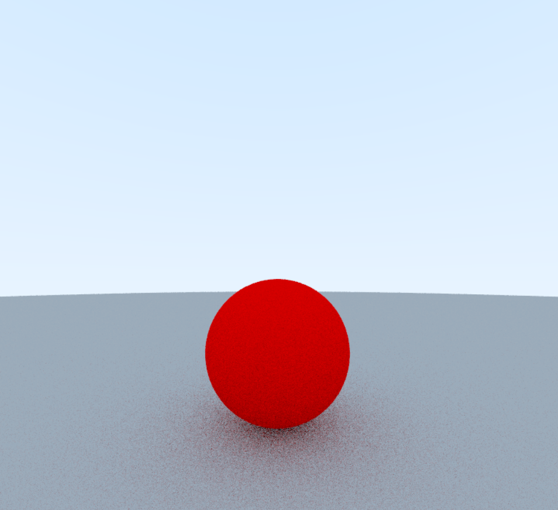

- **Metal**  
  Reflexão especular perfeita com `reflect()`. Controle de *smoothness* para metais lisos.  
  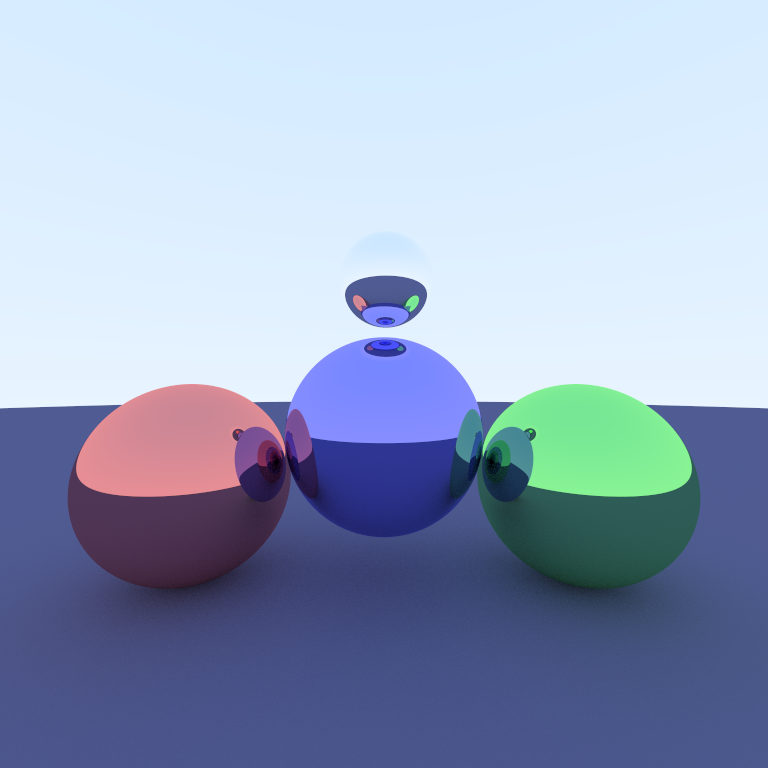

- **Fuzz**  
  Metal “escovado”: reflexão com desvio aleatório (*fuzzy reflection*) controlado por parâmetro.  
  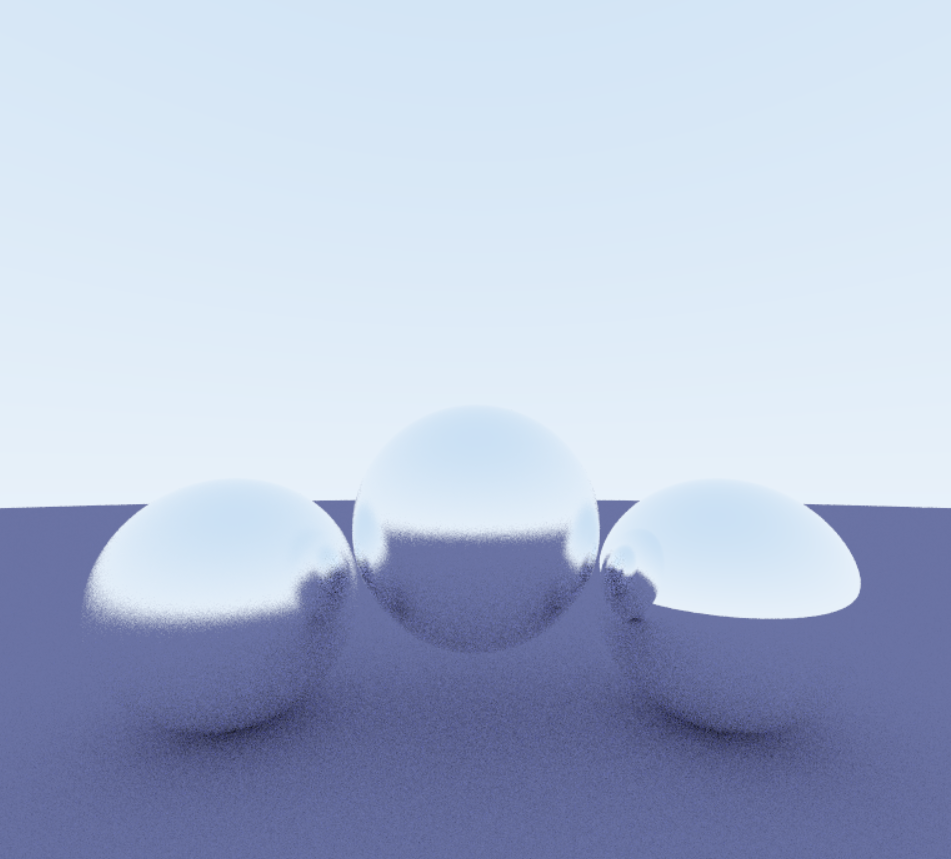

---

### C — “Specular”, “Emissive”

- **Specular**  
  Mistura difuso–especular via probabilidade/força especular no material (espelho ideal quando liso).  
  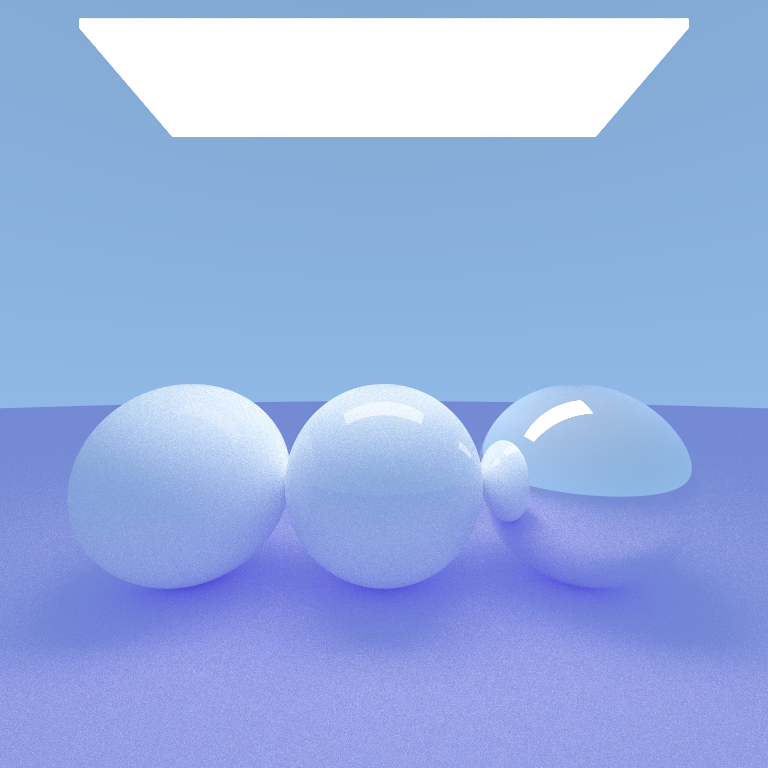

- **Emissive**  
  Superfícies emissivas contribuem diretamente para a radiância (quads/luzes de área).  
  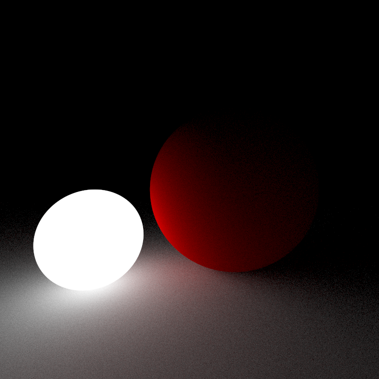

---

### C+ — “Dielectric”, “Spheres”, “Night”

- **Dielectric**  
  Refração com **Fresnel (aprox. de Schlick)**, IOR configurável e correção de *frontface* (normal invertida quando necessário).  
  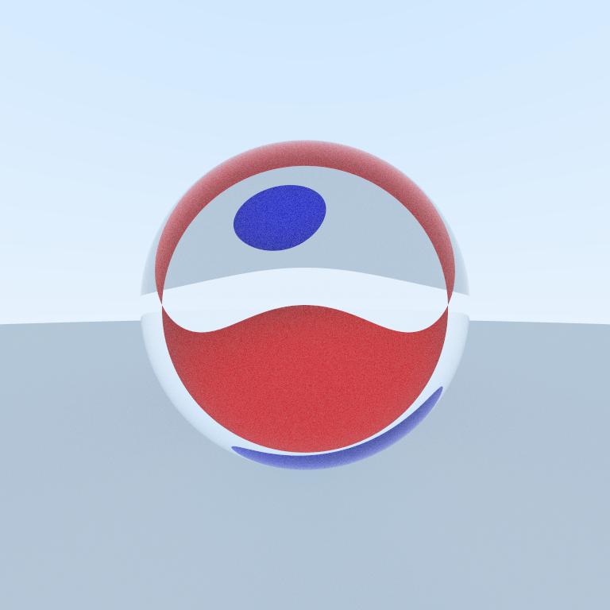

- **Spheres**  
  Cena com múltiplas esferas e materiais variados. Câmera com **DOF (thin lens)**: `aperture` e `focusDistance`.  
  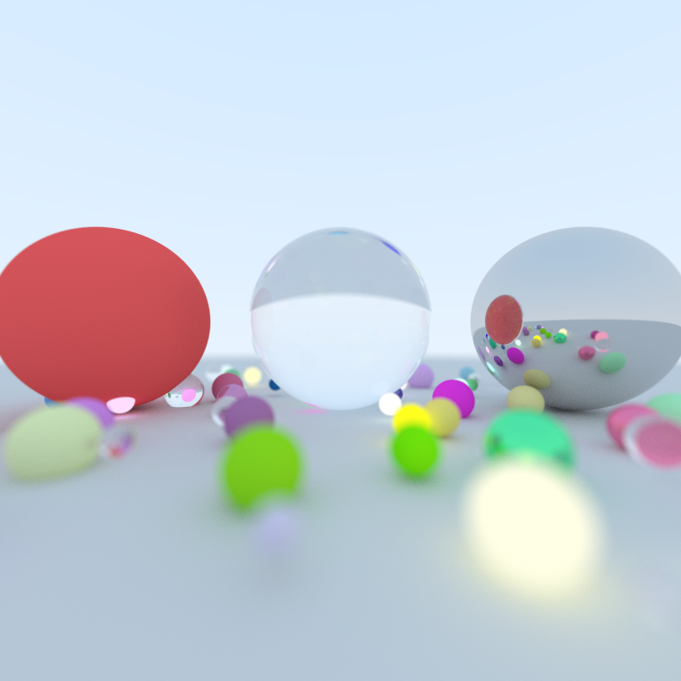

- **Night**  
  Ambiente noturno: *skybox* escuro, reduzindo contribuição do céu e enfatizando emissivos.  
  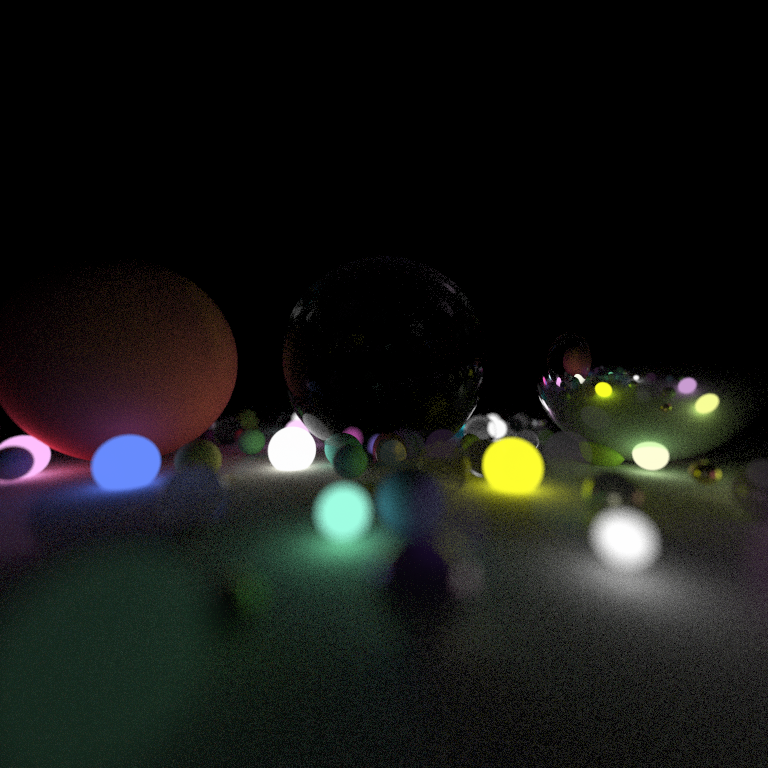

---

### B — “Cubes”, “Cornell”, “Mirror”, “Infinite”

- **Cubes**  
  Caixas/AABB com materiais diversos (implementação funcional). 
  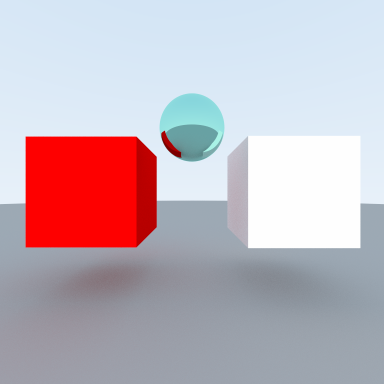

- **Cornell**  
  Sala de Cornell (paredes difusas coloridas, objetos e luz retangular no teto).  
  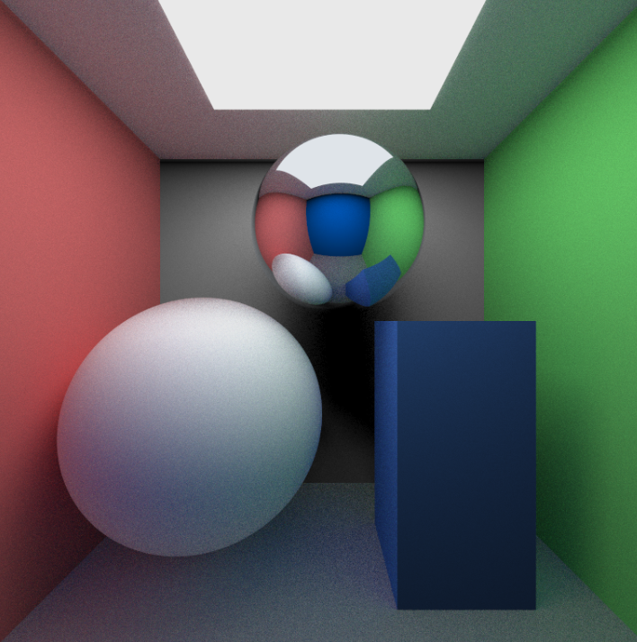

- **Mirror**  
  Cena dedicada a espelhos lisos (reflexão perfeita).  
  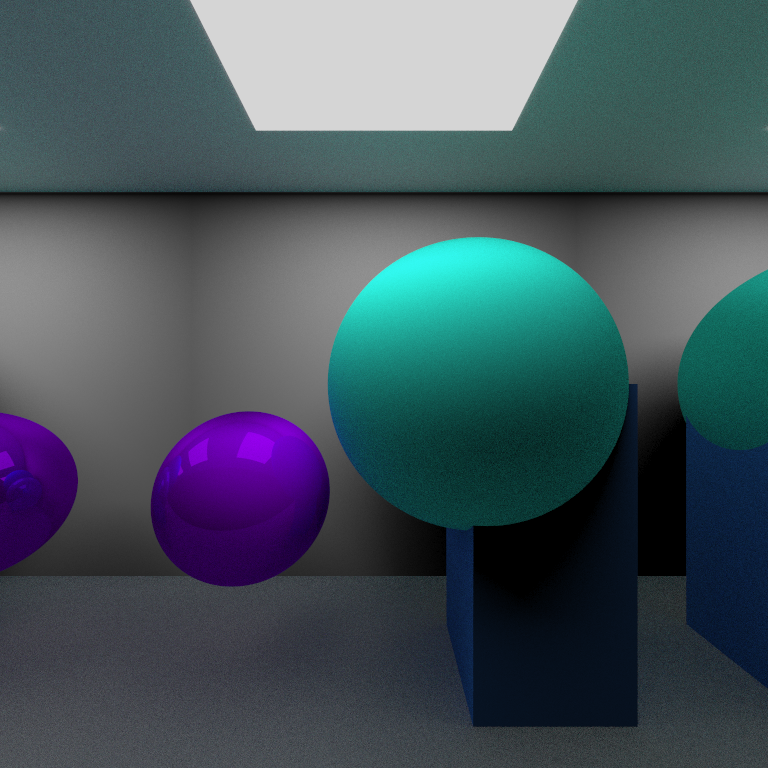

- **Infinite**  
  “Quarto” com espelhos em múltiplas faces para reflexões repetidas.  
  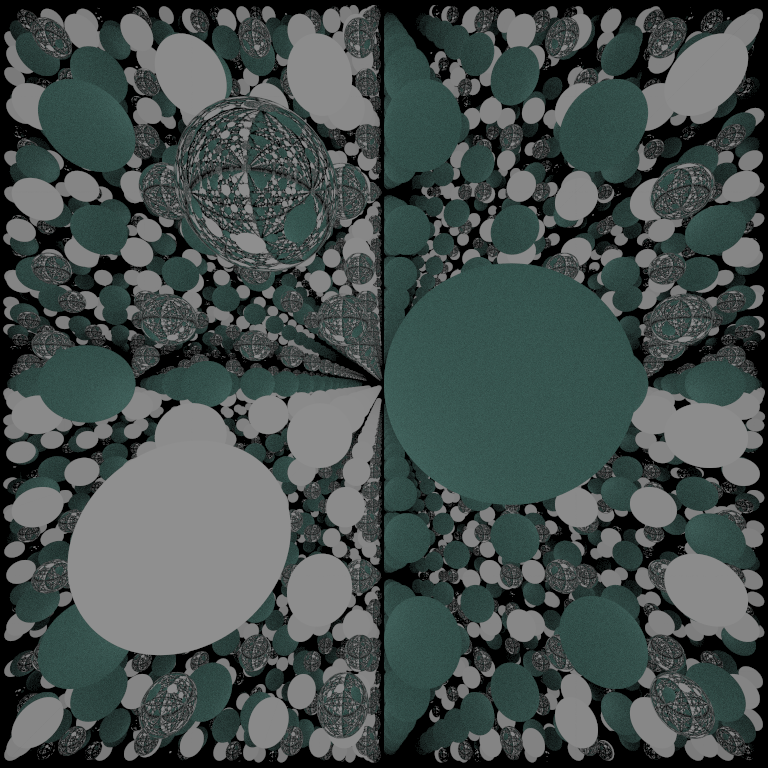

---

## Detalhes técnicos (resumo)

- **Materiais**: difuso (Lambert), metal liso e *fuzzy*, especular ideal, emissivo e **dielétrico** (refração + Fresnel).
- **Câmera**: modelo *thin lens* (DOF) com `aperture` e `focusDistance`.
- **Acumulação progressiva**: somatório de amostras ao longo do tempo com *gamma correction*.
- **Primitivas**: `Sphere`, `Quad`, `Box (AABB)`, `Triangle` e `Mesh` (suporte a OBJ).
- **Estabilidade**: *safe normalize* e **bias** em raios secundários para evitar *acne* e auto-interseções.

---

## Referência

Baseado no template: **Gustavobb/raytracing-wgsl-template**.  
Consulte o enunciado do projeto para a correspondência entre cenas e nota.